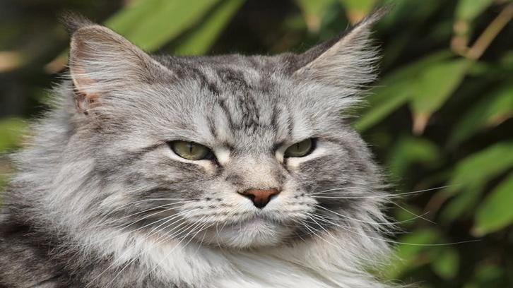
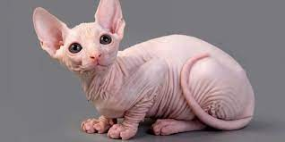

<!DOCTYPE html>
<head>  
    <title>Kucing</title>
    <h1>
 Kucing 

    </h1>

    

    

    <body> 
        <article>
        <h2>British Shorthair</h2>
        
Kucing bulu pendek britania adalah salah satu ras kucing tertua yang nenek moyang dipercayai memiliki hubungan dengan bangsa Romawi 
             yang pernah dahulu menguasai Inggris  Kucing ini adalah kucing berbadan sedang dengan bulu yang pendek.  
             Selain itu, kucing ini juga banyak menjadi ikon. 
             

        

        <h2>Kucing Anggora</h2>
        
 
            Nama kucing anggora mungkin masuk dalam daftar teratas yang muncul di benak 
            Anda, jika ditanya  jenis kucing apa yang penampilannya indah dan elegan. Tentunya hal ini sama  
            sekali tidak salah, sebab anggora memang punya pesona yang memikat. Apalagi kepribadiannya  
            yang aktif dan suka mencari perhatian pemiliknya. Hidup pun pastinya jadi lebih berwarna dengan anggora. 
            

        

        <h2> Kucing Spyhnx </h2>
        
 Kucing sphynx (dahulu bernama Canadian hairless) adalah salah satu ras kucing yang memiliki bulu sangat pendek dan sedikit sekali. 
             Jika dilihat sekilas, kucing sphynx tampak tidak memiliki bulu sama sekali, 
              tetapi jika diamati lebih saksama tubuh kucing ini ditumbuhi rambut halus di beberapa bagian, seperti telinga, kaki, ekor, dan didekat organ kelamin.

        

        <h3>Perbedaan ketiga kucing tersebut</h3>
        <table border="1">
            <tr>
                <th>Ciri-ciri</th>
                <th>Sphynx</th>
                <th>Anggora</th>
                <th>British Shorthair (BSH)</th>
            </tr>
            <tr>
                <td>Bulu</td>
                <td>Tidak berbulu (botak)</td>
                <td>Panjang dan lebat</td>
                <td>Pendek dan padat</td>
            </tr>
            <tr>
                <td>Warna Bulu</td>
                <td>Beragam</td>
                <td>Beragam</td>
                <td>Beragam</td>
            </tr>
            <tr>
                <td>Personalitas</td>
                <td>Ramah, aktif, suka hangat</td>
                <td>Tenang, manis, penyayang</td>
                <td>Tenang, santai, penuh kasih</td>
            </tr>
        </table>

     </article>
    </body>

</head>
